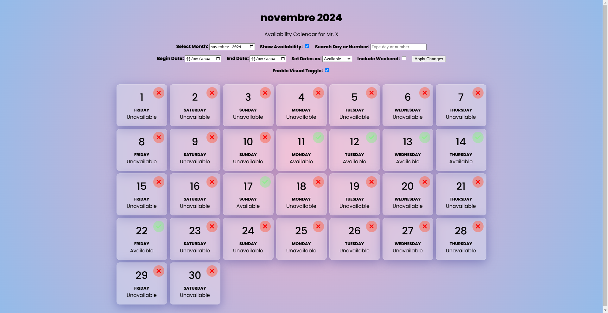

# Dynamic Calendar with Vue.js

This project creates a dynamic availability calendar using Vue.js. It allows users to select a month, view and update the availability of dates, and apply changes to specific date ranges.

## Screenshot

## Features

- **Month Selector**: Choose any month and view the calendar.
- **Availability Toggle**: Toggle the availability of days (Available/Unavailable).
- **Search**: Search by day name or day number.
- **Date Range Management**: Apply availability changes to a specific date range.
- **Weekend Option**: Include weekends in availability changes.
- **Visual Toggle**: Click days on the calendar to toggle their availability.

## Setup

1. Clone or copy the project files.
2. Open `index.html` in a browser to run the app.

## How it Works

- **Vue.js**: Handles reactivity for the calendar and form controls.
- **Availability Control**: Toggle availability via search or directly in the calendar.
- **Date Range**: Set a start and end date to apply availability changes to multiple days.

## Key Variables & Methods

- `selectedMonth`: The selected month (YYYY-MM).
- `showAvailability`: Controls whether availability is displayed.
- `searchQuery`: Filters days by name or number.
- `beginDate` & `endDate`: Date range for updating availability.
- `visualToggle`: Enables manual day toggling in the calendar.

## License

Open-source under the MIT License.
